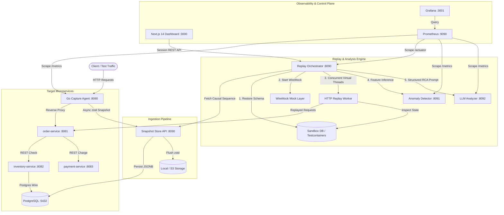
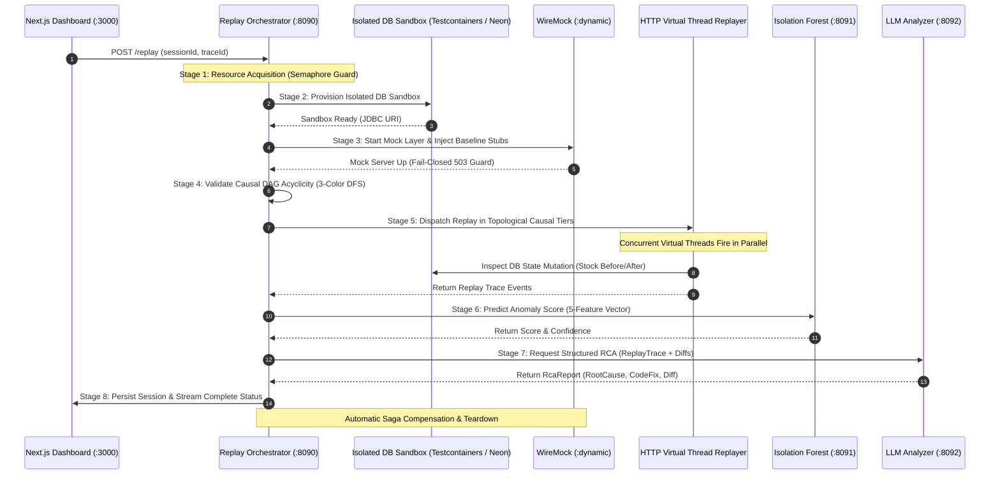
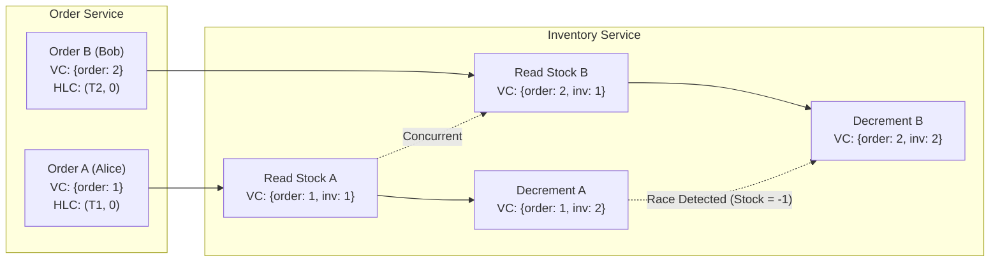

# Kairos System Architecture

Kairos is a deterministic distributed state capture and causal replay time machine for microservice architectures. It captures distributed HTTP transactions across service boundaries, attaches vector clock metadata, detects concurrency anomalies (e.g. TOCTOU race conditions) using unsupervised Isolation Forest ML, and replays execution traces inside isolated sandbox databases to perform automated LLM root cause analysis (RCA).

---

## 1. System Topology & Data Flow

---

## 2. Distributed Saga Replay Lifecycle

The replay orchestrator executes an 8-stage distributed saga with automatic resource cleanup and fail-closed egress boundaries:

---

## 3. Causal Consistency & Vector Clock Model

Kairos rejects wall-clock ordering (NTP skew, Leap Seconds) and guarantees causal consistency using bounded Vector Clocks and Hybrid Logical Clocks (HLC):

---

## 4. Component Port & Responsibility Matrix

| Component | Port | Technology | Primary Responsibility |
|---|---|---|---|
| **Capture Agent** | `8080` (public) | Go 1.22 | Zero-allocation reverse proxy, vector clock injection, zstd async streaming, non-blocking ring buffer load-shedding |
| **Order Service (Internal)** | `8081` | Spring Boot 3.2 (Java 21) | Target demo e-commerce checkout orchestrator with deterministic seed support (`X-Replay-Seed`) |
| **Inventory Service** | `8082` | Spring Boot 3.2 (Java 21) | Target stock management service with intentional un-guarded read-decrement race condition |
| **Payment Service** | `8083` | Spring Boot 3.2 (Java 21) | Simulated payment processing gateway with 40ms intentional latency |
| **Replay Orchestrator** | `8090` | Spring Boot 3.2 (Java 21 Loom) | 8-step Saga coordinator, causal DAG tier execution via Virtual Threads, CQRS projection worker |
| **Anomaly Detector** | `8091` | FastAPI + Scikit-Learn | Real-time Isolation Forest inference on 5-feature traffic metric windows (`< 1ms` latency) |
| **LLM Analyzer** | `8092` | FastAPI + LangChain + Gemini | Automated Root Cause Analysis (RCA), generating structured git diff patches and confidence metrics |
| **Dashboard** | `3000` | Next.js 14 + D3.js | Interactive causal timeline visualization, DB diff inspection, and replay controls |
| **PostgreSQL** | `5432` | PostgreSQL 15 | Persistent snapshot store, materialized causal ordering tables, and target inventory catalog |
| **Prometheus** | `9090` | Prometheus v2.48 | Distributed metric scraping across all Go, Java, and Python microservices |
| **Grafana** | `3001` | Grafana v10.2 | Real-time telemetry visualization for sidecar overhead, queue depth, and anomaly rates |

---

## 5. Failure Modes & Resilience Engineering

1. **Carrier Thread Pinning Prevention**: Database IO operations during replay are scheduled on dedicated platform thread pools (`kairos-db-io`) rather than pinning Virtual Thread carrier threads during JDBC socket blocking.
2. **Fail-Closed Egress Isolation**: During replay, all outbound network calls are intercepted by WireMock. Any unrecorded downstream request receives an immediate HTTP 503 response to prevent accidental real-world side effects.
3. **Capture Agent Load Shedding**: If the snapshot worker channel fills past capacity, the capture agent sheds snapshot persistence non-blockingly while preserving user-facing proxy throughput.
4. **Saga Teardown Guarantees**: Sandbox database containers (Testcontainers) and ephemeral cloud branches (Neon) implement `AutoCloseable` lifecycle hooks to guarantee resource reclamation even on replay errors.
